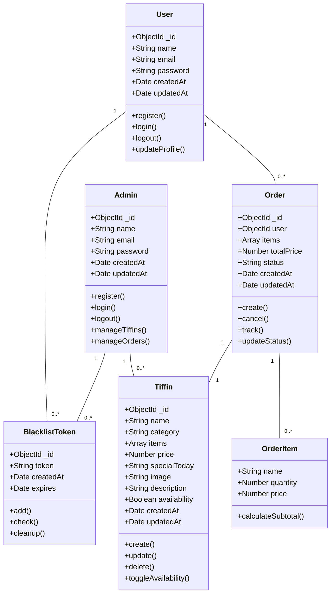
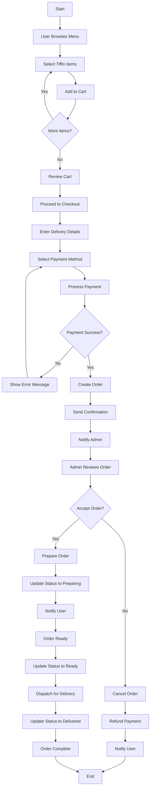
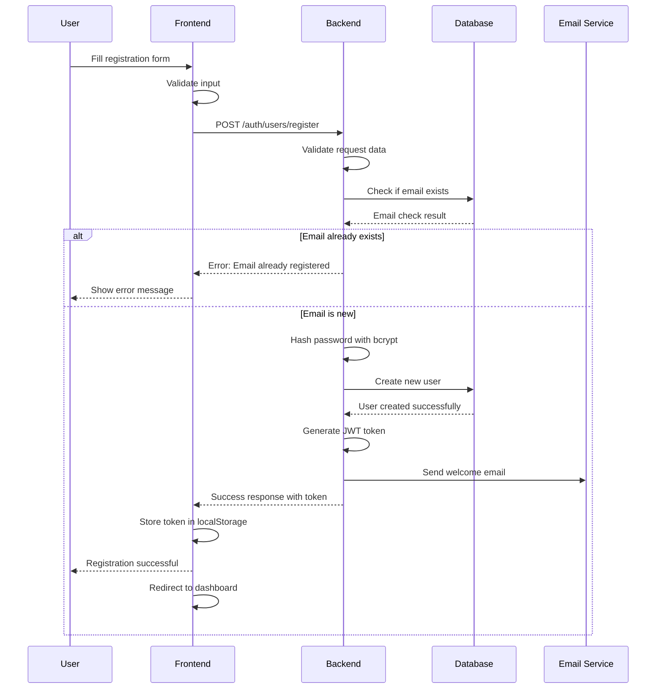
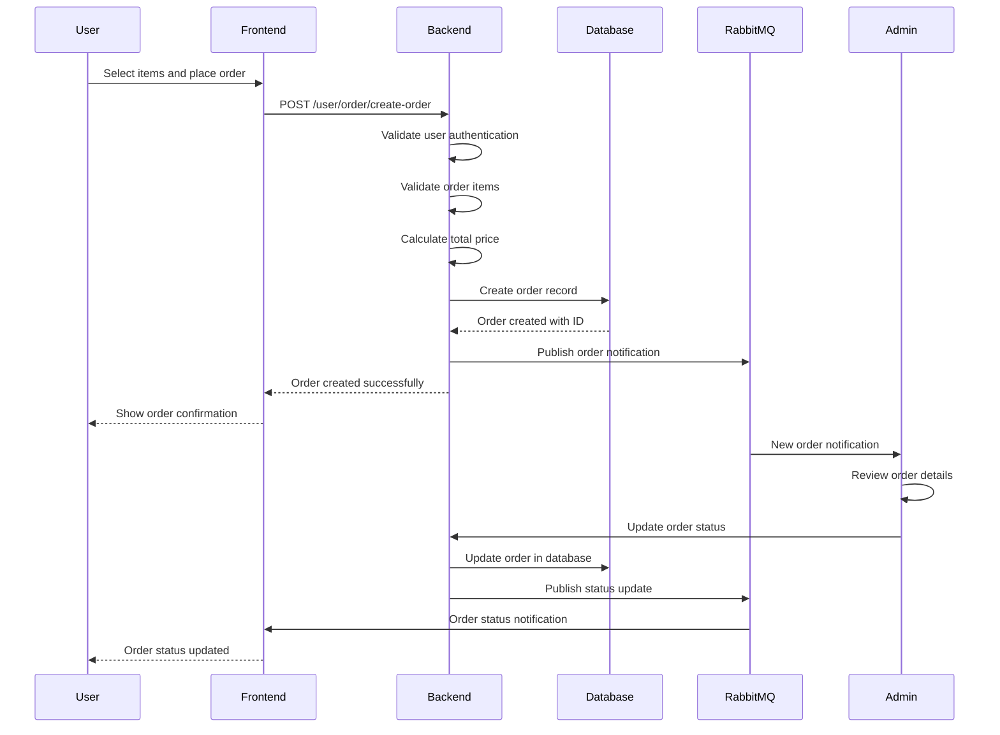
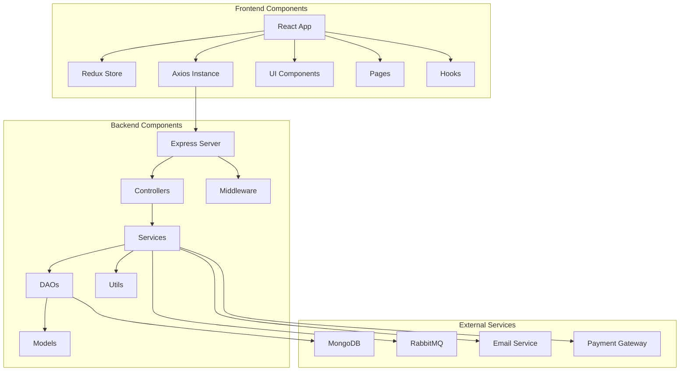
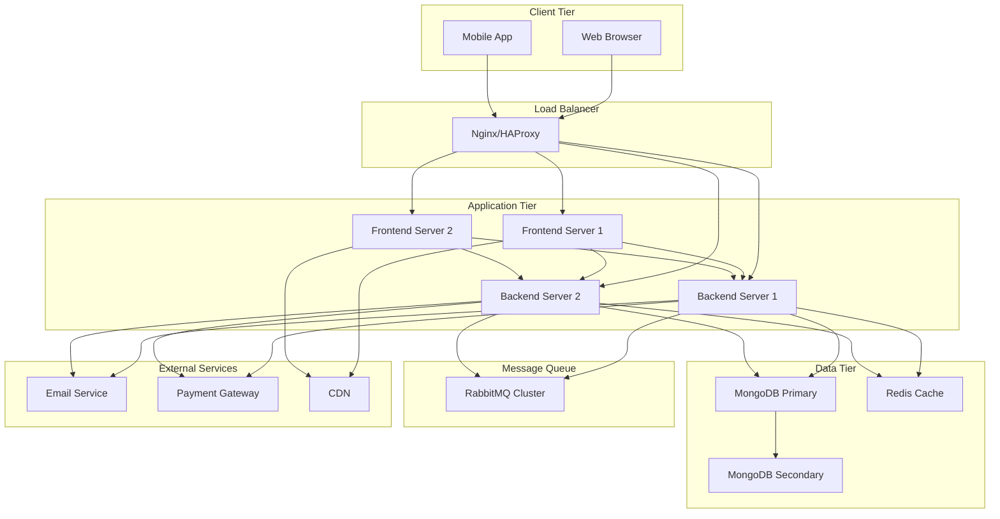

# Food Order Application - UML Diagrams

## Class Diagram

## Use Case Diagram

```mermaid
graph TB
    subgraph "Food Order System"
        subgraph "Customer Use Cases"
            UC1[Register Account]
            UC2[Login/Logout]
            UC3[Browse Menu]
            UC4[Filter Tiffins]
            UC5[Place Order]
            UC6[Track Order]
            UC7[Cancel Order]
            UC8[View Order History]
        end
        
        subgraph "Admin Use Cases"
            UC9[Admin Login]
            UC10[Manage Tiffins]
            UC11[Create Tiffin]
            UC12[Update Tiffin]
            UC13[Delete Tiffin]
            UC14[View All Orders]
            UC15[Update Order Status]
            UC16[Manage Users]
            UC17[View Analytics]
        end
        
        subgraph "System Use Cases"
            UC18[Send Notifications]
            UC19[Process Payments]
            UC20[Generate Reports]
            UC21[Backup Data]
        end
    end
    
    Customer --> UC1
    Customer --> UC2
    Customer --> UC3
    Customer --> UC4
    Customer --> UC5
    Customer --> UC6
    Customer --> UC7
    Customer --> UC8
    
    Admin --> UC9
    Admin --> UC10
    Admin --> UC11
    Admin --> UC12
    Admin --> UC13
    Admin --> UC14
    Admin --> UC15
    Admin --> UC16
    Admin --> UC17
    
    System --> UC18
    System --> UC19
    System --> UC20
    System --> UC21
```

## Activity Diagram - Order Process

## Sequence Diagram - User Registration

## Sequence Diagram - Order Creation

## Component Diagram

## Deployment Diagram

